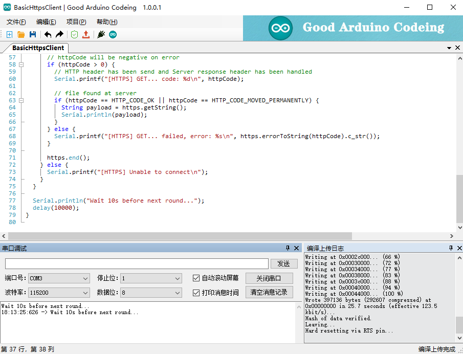
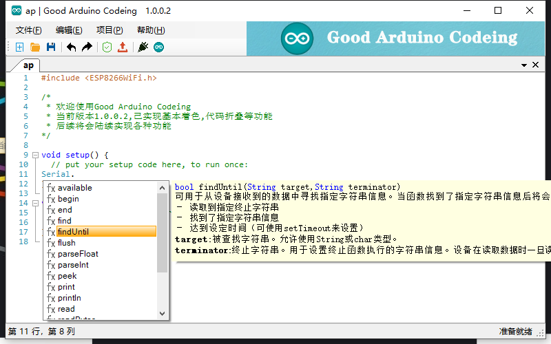
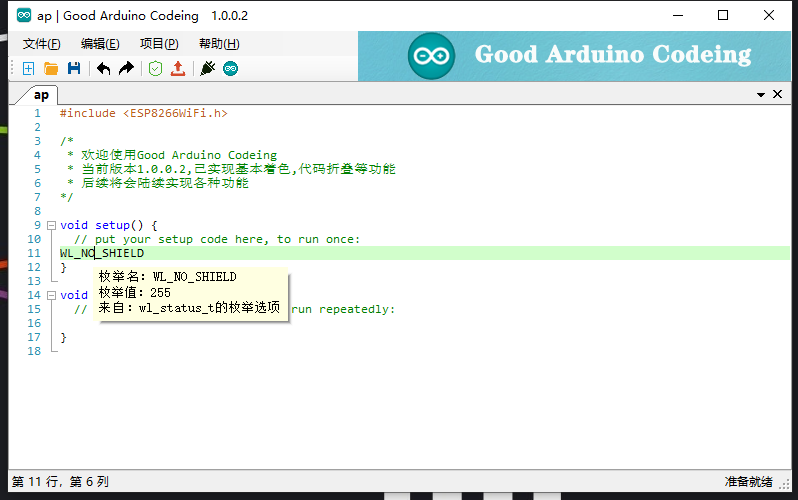

# Gac Arduino Ide

## 简介

**Good Arduino Codeing**

不错的Arduino编辑工具,为了弥补小白在写代码时得不到有效的提示而诞生。

在实现了代码提示的基础上,功能越来越完善,已实现代码高亮,主题风格,代码书签,代码放大缩小,代码搜索,示例和库的加载,让开发者创作更加容易,更加舒适

> 首次使用加载时间会较长

## 界面预览

### 主界面

### 方法提示

### 枚举提示

## 已实现功能

1. 支持代码提示的Arduino代码编辑器
2. 支持代码主题风格
3. 支持代码折叠
4. 支持代码搜索和替换
5. 支持最近文件,Arduino示例读取
6. 支持引用库
7. 支持放大缩小
8. 支持复制html代码和html格式
8. 支持书签,长篇代码中方便跳转
9. 自带串口调试小工具
10. 调用ArduinoIde完成验证和上传
11. 支持加载库
12. 更好用的参考文件搜索

## 开发指南

开发的本意是为了能够在书写Arduino代码时能够实现简单的提示,更方便我这种入门学者的学习

后续为了更加方便使用,尽可能多的提示内容和尽量不再来回切换窗口

额外增加了许多常用小功能

但奈何技术能力有限,很多地方我并不是很满意

但由于工作繁忙很少有时间抽出来继续完善他

**现将代码完全开源,希望大家可以对齐添砖代码**

代码凌乱不堪，无学习价值

程序是使用`C#`开发的`WinForm`程序,整理代码开源时使用的`Vs2022`,框架版本`net framework 4.8`

部分功能采用以下优秀开源产品(排名不分先后)

.Net Docking Library for Windows Forms，ScintillaNET，Autocomplete-Menu，AutoUpdate

开源时已去除了之前的版本检测

## 缺陷

1. 帮助文档加载过慢
2. 代码分析方式简单粗暴
3. 不能在软件中直接修改主板型号
4. ...

## 参与贡献

**由衷的希望大家可以将此编辑器继续完善**,或者官方能更加的方便到我们这些新人,降低我们的学习门槛

[提一个 Issue](https://github.com/wanglong126/gac_arduino_ide/issues/) 或者提交一个 `Pull Request` 都可以更好的了解大家的需求

**Pull Request:**

1. Fork 代码!
2. 创建自己的分支: `git checkout -b feat/xxxx`
3. 提交你的修改: `git commit -am 'feat(function): add xxxxx'`
4. 推送您的分支: `git push origin feat/xxxx`
5. 提交`pull request`

## 打赏作者

如果你觉得这个项目帮助到了你，可以对作者进行打赏,以便后续提供更大的动力

